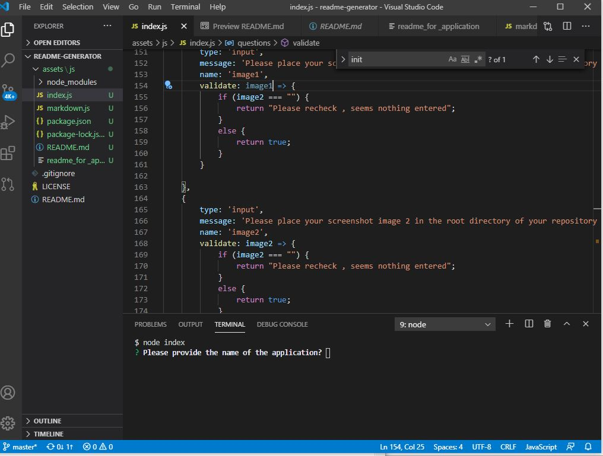
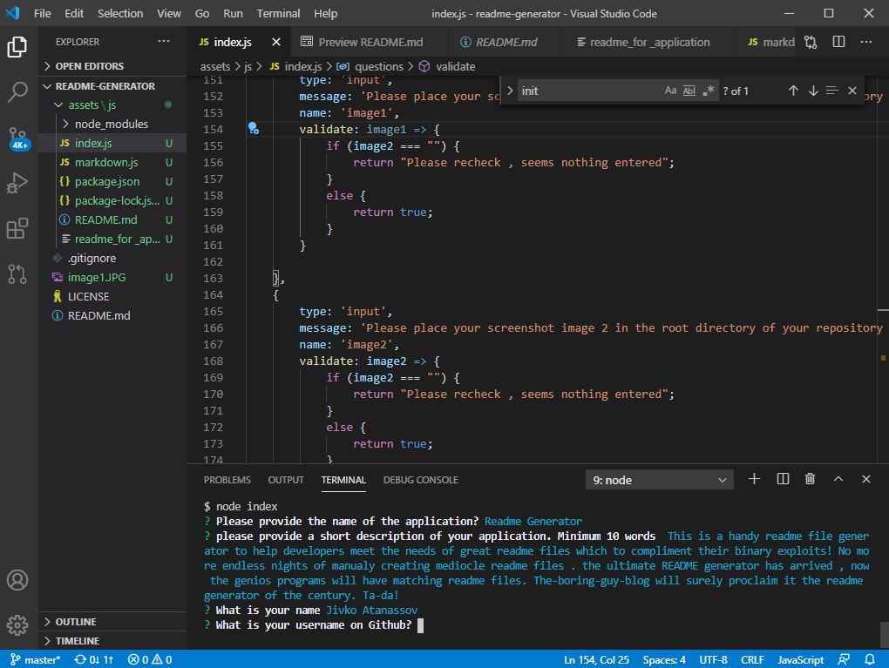

    
# Title : readme-generator

## Description
Author: Jivko Atanassov

This is a handy readme file generator to help developers meet the needs of great readme files which to complement their binary exploits! No more endless nights of manually creating mediocre readme files. the ultimate README generator has arrived, now the genius programs will have matching readme files. The-boring-guy-blog will surely proclaim it the readme generator of the century!

Github User name: zhim57

## Table of Contents:
- [Title](#title)
- [Description](#description)
- [Table of Contents](#table-of-contents)
- [Installation](#installation)
- [Usage](#usage)
- [License](#licence)
- [Contributing](#contributing)
- [Tests](#tests)
- [Questions](#questions)

## Installation
Please first install inquirer:   npm i inquirer, then run node index.
## Usage
- Web development/front end
- Node.js  application
- Web development back end
- Database Application
- Productivity Application
- iOS App
- Android app
- entertainment application
- Financial App
- transportation application
- other
Yes, please download this readme generator, the inventory of digital copies is depleting as we speak,  please snatch yours while you still can!!!
## Email
zhim57@yahoo.com
## Contributing
none
## License

## Tests
none

## Questions
please email Jivko Atanassov with any questions at: zhim57@yahoo.com. Thank You.

## Links

[link to this portfolio](https://github.com/zhim57/readme-generator)

[link to the deployed application](https://github.com/zhim57/readme-generator)
  

## Screenshots

[link to the video walk around](https://drive.google.com/file/d/17b220GzkOREfELclfLiixOgT_Ob4euU9/view)
  